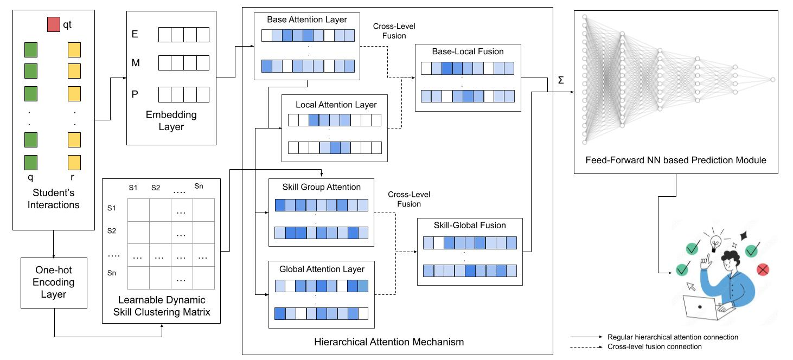

# HiSACKT: Combining Hierarchical Self-Attention and Skill Clustering to Enhance Knowledge Tracing

**Official implementation of the HiSACKT model**  
Accepted at the *24th IEEE/WIC International Conference on Web Intelligence and Intelligent Agent Technology (WI-IAT 2025)*

**Authors:** Duaa Baig, Diana Nurbakova, Baba Mbaye, and Sylvie Calabretto.

---

## 🧠 Overview
HiSACKT (Hierarchical Self-Attention and Skill Clustering for Knowledge Tracing) enhances traditional knowledge tracing models by integrating hierarchical self-attention layers and dynamic skill clustering to capture both local and global dependencies in student learning behavior.



---

## 📦 Installation

```bash
git clone https://github.com/duaabaig/HiSACKT.git
cd HiSACKT
pip install -r requirements.txt
```

---

## 🚀 Usage

To train or evaluate HiSACKT on a specific dataset:

```bash
python main.py --model_name hisackt --dataset_name ASSIST2015
```

Supported datasets: `ASSIST2009`, `Algebra2005`, `Statics2011`, `ASSIST2015`

---

## 📊 Experimental Results

| Model | ASSISTMENT2009 (AUC / Loss) | ALGEBRA2005 (AUC / Loss) | Statistics2011 (AUC / Loss) | ASSISTMENT2015 (AUC / Loss) |
|:--|:--:|:--:|:--:|:--:|
| DKT | 79.15 / 0.60 | 80.75 / 0.56 | **77.93** / 0.55 | 72.41 / 0.60 |
| DKT+ | 80.16 / 0.64 | 81.85 / 0.58 | 77.86 / 0.57 | 71.94 / 0.61 |
| DKVMN | 72.01 / 0.55 | 81.08 / 0.42 | 74.32 / 0.44 | 70.88 / 0.52 |
| GKT-PAM | 78.24 / 0.50 | 78.36 / 0.43 | 74.33 / 0.44 | 71.88 / 0.51 |
| GKT-MHA | 78.71 / 0.50 | 73.29 / 0.49 | 71.26 / 0.46 | 72.70 / 0.51 |
| SAKT | 79.59 / 0.49 | 80.74 / 0.43 | 75.35 / 0.44 | 72.38 / 0.51 |
| **HiSACKT** | **82.28 / 0.44** | **91.51 / 0.26** | 76.72 / **0.42** | **93.33 / 0.24** |

---

## 🧩 Ablation Study

| Model Variant | ASSIST2009 | Algebra2005 | Statistics2011 | ASSIST2015 | Avg AUC |
|:--|:--:|:--:|:--:|:--:|:--:|
| HiSACKT (Full) | **82.28** | **91.50** | **76.72** | **93.33** | **85.96** |
| w/o Skill Clustering | 81.66 ↓0.62 | 83.70 ↓7.81 | 75.63 ↓1.09 | 92.30 ↓1.03 | 83.32 ↓2.64 |
| w/o Local Attention | **83.20 ↑0.92** | 89.79 ↓1.72 | **77.45 ↑0.73** | **95.19 ↑1.86** | **86.41 ↑0.45** |
| w/o Cross-Level | 81.49 ↓0.79 | 82.61 ↓8.90 | 76.63 ↓0.09 | 83.31 ↓10.02 | 81.01 ↓4.95 |
| w/o Skill-Group | 81.24 ↓1.04 | 85.30 ↓6.21 | 75.79 ↓0.93 | 82.61 ↓10.72 | 81.24 ↓4.72 |

---

## 📚 Dataset Links

1. [ASSISTment2009](https://tinyurl.com/33adbs9w)  
2. [Algebra2005](https://tinyurl.com/hruvenje)  
3. [Statics2011](https://tinyurl.com/bdd9zsrz)  
4. [ASSISTment2015](https://tinyurl.com/455n5h2n)

---

## 🔗 Acknowledgement

The data loader and baseline models (DKT, DKVMN, SAKT, GKT, etc.) are adapted from  
[hcnoh/knowledge-tracing-collection-pytorch](https://github.com/hcnoh/knowledge-tracing-collection-pytorch) (MIT License).

---

## 📜 License

This project is licensed under the MIT License - see the [LICENSE](./LICENSE) file for details.

---

## 🖋️ Citation

If you use this code, please cite:

```bibtex
@inproceedings{baig2025hisackt,
  title={Combining Hierarchical Self-Attention and Skill Clustering to Enhance Knowledge Tracing (HiSACKT)},
  author={Baig, Duaa and Nurbakova, Diana and Mbaye, Baba and Calabretto, Sylvie},
  booktitle={Proceedings of the 24th IEEE/WIC International Conference on Web Intelligence and Intelligent Agent Technology (WI-IAT)},
  year={2025},
  doi={TBA}
}
```
